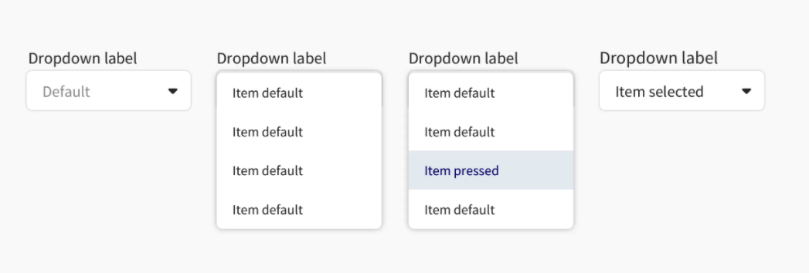
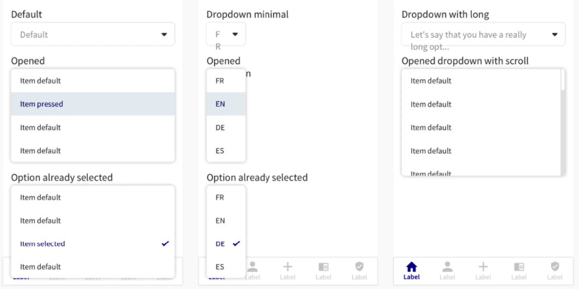

You can think of drop downs as "mini menus" inside another element on a given page in your mobile application. They allow users to make a selection from multiple options.

A drop down element is composed by a main part, a field that suggest users to click on it and a list, that appears when the user interacts with the field. Following the interaction, a list of options appears.





The dropdown element should always be used in full width, only constrained by an eventual body padding. Same advice applies for the drop down list. In case you do need to change the size of the drop down, please respect the below/




### Usage

````javascript
const items = [
  {
    label: "label 1",
    value: "hello",
  },
  {
    label: "label 2",
    value: "mami",
  },
]

const MyComponent = () => (
  const [value, setvalue] = useState({});

  <DropDown items={items}  title="axa DropDown" setvalue={setvalue}>
);

````


## Props 

### title
Type: String

_Text to display for the DropDown, if not provided, first element label of items will be default value._

### items
Type: Array

_Array of elements to be displayed in your DropDown. Each Element should be an object with two value {label: field Label, value: field value}, you can use the value to capture the value of selected item._

### disabled
Type: boolean

_Disables the dropdown._

### setvalue
Type: () => void

_Function that will give you the selected item object. You can then access label and value of it. example: {
  "label": "label 1",
  "value": "mami"
}_


