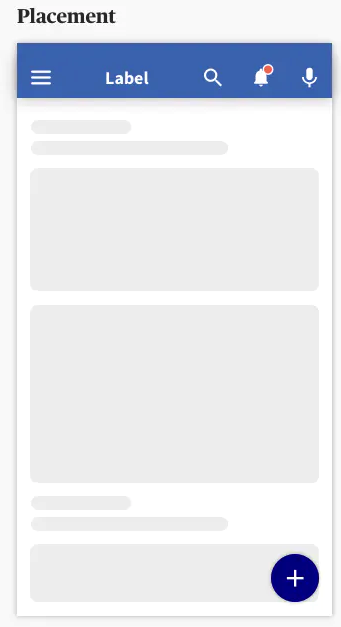
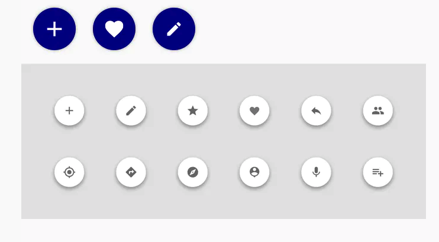

Floating button, or also called floating action button, serves to perform the primary action of the screen. It is not an obligatory element and should be used only when the content of your mobile app page requires it.




A floating action button (FAB) can trigger an action either on the current screen, or it can perform an action that opens a new screen.



Depending on your content, you can use a wire range of functional icons - just make sure that the icon you chose is coherent with the action which the floating button will serve. The default icon is "plus" icon, but you can change through the **icon** prop. You can use all icons in _"MaterialCommunityIcons"_, you just have to provide the icon name as a string. Using the icon prop is recommended but You can still use your own icon through the **image**.


### Usage

````javascript
const MyComponent = () => (

    <View
      style={{
        width: "100%",
        height: "100%",
      }}
    >
      <Floating icon="email" onPress={() => console.log('pressed')} />
    </View>
);
````


## Props 

### icon
Type: String

_name of icon you want to use, default is **plus**, you can use all icon in MaterialCommunityIcons._

### secondary
Type: boolean

_Actives the secondary theme._

### disabled
Type: boolean

_Disables the button._

### onPress
Type: () => void

### right
Type: Number

_Change the positon of button on X axis, default is 20_

### bottom
Type: Number

_Change the positon of button on Y axis, default is 20_
