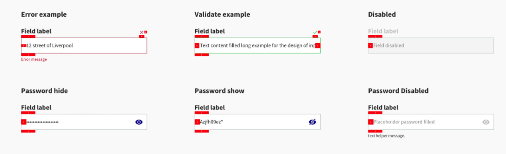

Form input can be used in various context, with the objective to gather information about your user.




### Usage

To achieve a Cover, we provide you a _Cover_ API. this is an API that is used to display both Videos and Images. 

````javascript
const MyComponent = () => (
  const [formValue, setformValue] = useState('');
  const [error, seterror] = useState(null);
  const [success, setsuccess] = useState(false);

  <FormInput formValue={formValue} setformValue={setformValue} label="Label of Input" error={error} success={success} />
);

````


## Props 

### formValue
Type: String,

_Text of Input._

### label
Type: String,

_Label of Input._

### Password
Type: boolean

_Secure Encryption of Input values will be enabled, and an icon will appears at right of Input allowing you to toggle visibility of your password._

### setformValue
Type: func => void

_To change value of formValue._

### error
Type: string

_Triggers error theme of input, if provided a message, it will be displayed in red under the input_

### success
Type: boolean

_Triggers success theme of input_

### disabled
Type: boolean

_Disables input_
