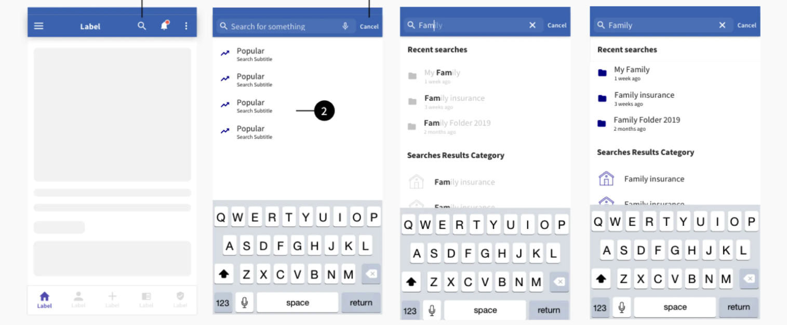

The goal of this design element is to help users find specific information in your mobile application. On this page you will find the ready-to-use designs of a classical search field element (and its states), which will help you create a search field that fits your application needs.


## Search field explained

Let's have a look at how search mechanism works.

On the first point (1) you’ll see the magnifier icon that open the search.

On the second screen, the opened state of the search element, you’ll see a search bar (3) that allows the user to search by typing characters, search by voice or “Cancel” and get back to the previous top bar.

You can see that the body of the page has changed too - even if the user doesn't type anything, we would recommend that you to put 4-5 highlights as shortcuts depending on your app's theme (2).




### Usage

To achieve a Search Page, we provide you a _Search_ API. to display the results, you can make use of _SearchList_ component. 

````javascript
const MyComponent = () => (
    const [warning, setwarning] = useState(false)
    const [success, setSuccess] = useState(false)
    
    const onAction1 = () => console.log('hello')
    const onIconPress = () => console.log('icon clicked')

    return (
      <Search leftIcons={leftIcons} rightIcons={rightIcons} secondary>
        <SearchList name="Title Of the list" results={ArrayOfResults} />
      </Search>
    )
);

````

## Props of Search 

### name
Type: string

_The Title you want to display in the Notification._


### text
Type: string

_The Message of notification._


## Props of SearchList

### results
Type: array

_Array of results. Each result should be an object and have the 4 the following properties: **icon, title, subtitle and onPress**_

_eg:_
````javascript
const ArrayOfResults = [
  {
    icon: "email",
    title: "hello",
    subtitle: "mame",
    onPress: () => console.log("Hello 1"),
  },
  {
    icon: "magnify",
    title: "hello2",
    subtitle: "mame2",
    onPress: () => console.log("Hello 2"),
  },
  {
    icon: "search",
    title: "hello3",
    subtitle: "mame3",
    onPress: () => console.log("Hello 3"),
  },
];
````