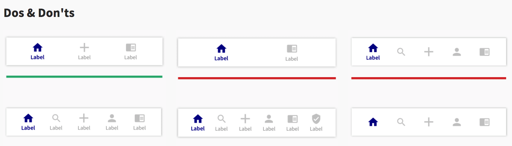

A well designed navigation element should clearly aid the user on three fundamental questions:
_
Where am I ?
Where else can I go ?
What will I find when I get there?_
Tab bars are great for serving these three simultaneously - it shows the user her current position and also gives her hints on where she can further go in the architecture of the app and what she should expect to find there.

Due to the fact that they are present in almost every screen, they allow for access to a deeper content (navigate from a parent screen to a child screen) without losing context and your position in the app.



To use this navigator, ensure that you have installed React Native navigation and it's dependencies:

````javascript
npm install @react-navigation/native

expo install react-native-gesture-handler react-native-reanimated react-native-screens react-native-safe-area-context @react-native-community/masked-view
````

````javascript
npm install @react-navigation/bottom-tabs
````


### Usage

````javascript
import { createBottomTabNavigator } from '@react-navigation/bottom-tabs';
import { MaterialCommunityIcons } from "@expo/vector-icons";

const Tab = createBottomTabNavigator();

function MyTabs() {
  return (
    <Tab.Navigator
     tabBarOptions={{
        activeTintColor: "#020191",
      }}>
      <Tab.Screen name="Home" component={HomeScreen} options={{
          tabBarLabel: "Home",
          tabBarIcon: () => (
            <MaterialCommunityIcons name="home" color="#CBCBCB" size={25} />
          ),
        }}/>
       <Tab.Screen name="Search" component={SearchScreen} options={{
          tabBarLabel: "Search",
          tabBarIcon: () => (
            <MaterialCommunityIcons name="Search" color="#CBCBCB" size={25} />
          ),
        }}/>
      
    </Tab.Navigator>
  );
}
````
