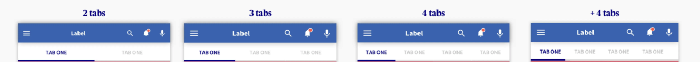

Tabs are one of the most used components of mobile user interfaces because they allow users to quickly move between a small number of equally important content. When implemented correctly, tabs are considered to be an excellent user interface control that contribute towards improving usability.

Tabs can be very useful when you want to show your user additional data to the content on the current view. These are not to be confused with Tab navigation, where users expect to be redirected to a different view, which might not be related to the current view.


Tabs should always be used in a set, and should be represented on a tab bar. All content within a set of tabs should be related under a larger organising principle, with each tab’s content mutually exclusive of the others.




To use this navigator, ensure that you have installed React Native navigation and it's dependencies:

````javascript
npm install @react-navigation/native

expo install react-native-gesture-handler react-native-reanimated react-native-screens react-native-safe-area-context @react-native-community/masked-view
````

````javascript
npm install @react-navigation/material-top-tabs react-native-tab-view
````


### Usage

To use this tab navigator, import it from _@react-navigation/material-top-tabs_:


````javascript
import { createMaterialTopTabNavigator } from '@react-navigation/material-top-tabs';
import { MaterialCommunityIcons } from "@expo/vector-icons";

const Tab = createMaterialTopTabNavigator();

function MyTabs() {
  return (
    <Tab.Navigator
     tabBarOptions={{
        activeTintColor: "#020191",
      }}>
      <Tab.Screen name="Home" component={HomeScreen} options={{
          tabBarLabel: "Home",
          tabBarIcon: () => (
            <MaterialCommunityIcons name="home" color="#CBCBCB" size={25} />
          ),
        }}/>
       <Tab.Screen name="Search" component={SearchScreen} options={{
          tabBarLabel: "Search",
          tabBarIcon: () => (
            <MaterialCommunityIcons name="Search" color="#CBCBCB" size={25} />
          ),
        }}/>
      
    </Tab.Navigator>
  );
}
````
