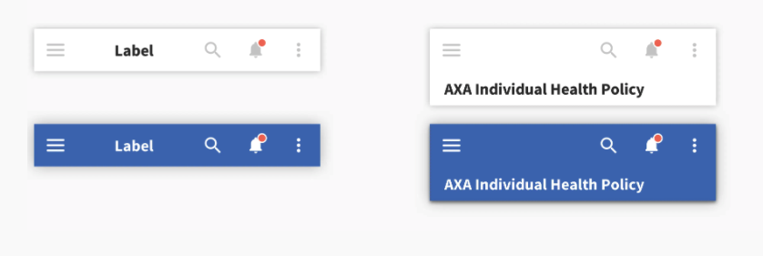
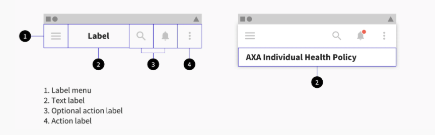
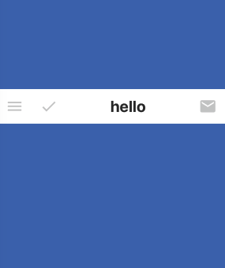
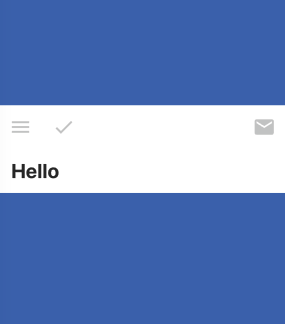

The header is a toolbar **at the top of the mobile screen**, which **serves as additional navigation to the Tab bar** at the bottom of the page, and is present throughout the entire user journey (only dialog and modal pages make an exception).

The choice of header will strongly depend on the context and the content of the screen.




The header component is composed of different elements, which you can move around depending on your content needs.



### Usage

To achieve a Header, we provide you a Header API wich is very flexible. You can use use it by following this example. 

````javascript
const rightIcons = [
  {
    icon: "email",
    onPress: () => console.log("email"),
  },
];

const leftIcons = [
  {
    icon: "menu",
    onPress: () => console.log("menu"),
  },
  {
    icon: "check",
    onPress: () => console.log("check"),
  },
];


const MyComponent = () => (


   <Header
        leftIcons={leftIcons}
        rightIcons={rightIcons}
        text="Hello"
     
      />
);

````

wich will give :




or

````javascript
const MyComponent = () => (


    <Header leftIcons={leftIcons} rightIcons={rightIcons} >
          Hello
    </Header>
);
````

wich will give :




## Props 

### leftIcons
Type: Array,

_Array of icons to be displayed at the left side of Header. Each icon is an object with two properties: 'icon'(String) and 'onPress' (Func)._

### rightIcons
Type: Array,

_Array of icons to be displayed at the right side of Header. Each icon is an object with two properties: 'icon'(String) and 'onPress' (Func)._


### secondary
Type: boolean

_Switches header theme to secondary._

### text
Type: string

_Text to be displayed in middle on the header_


#### children
Type: string

_Text to be displayed below the header_

