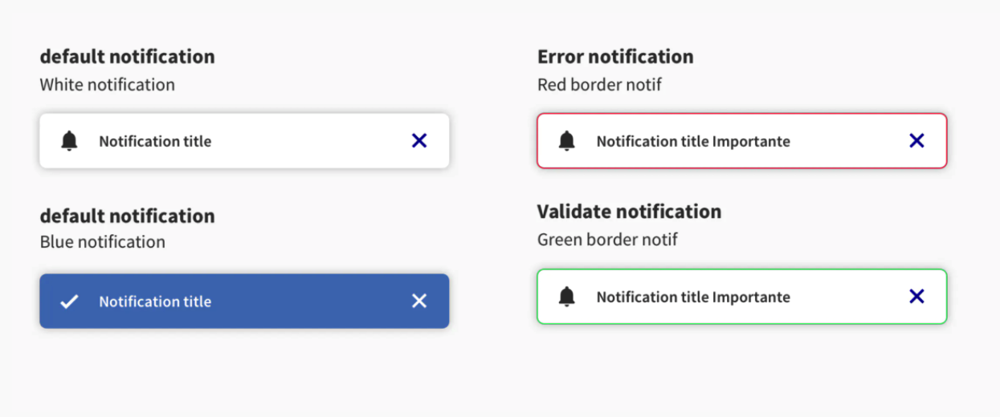
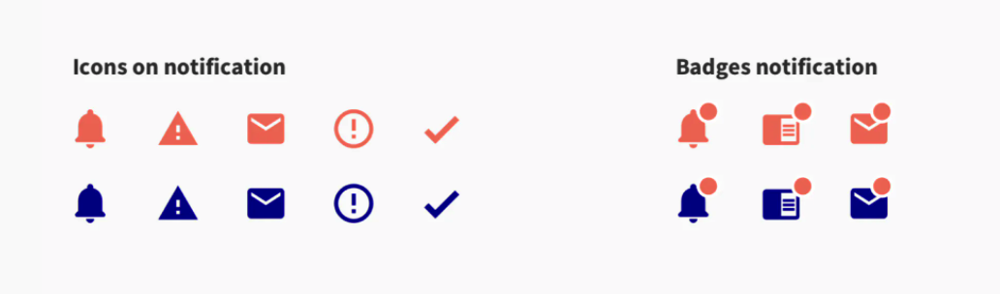
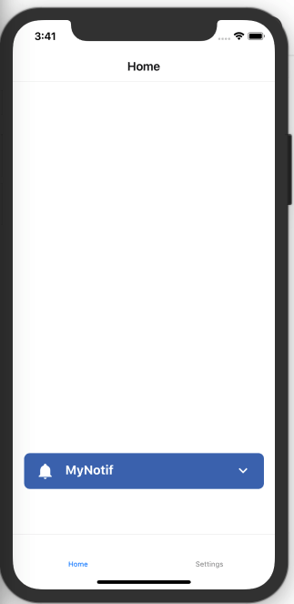
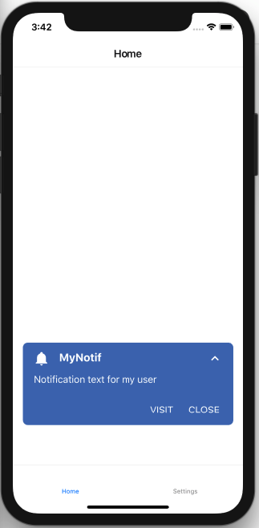

Notification elements, also called snackbars, inform users of a process that an app has performed or will perform. They appear temporarily, usually at the bottom of the screen. Their design should not interrupt the user in her experience with your mobile application, but discretely inform her.

## Notification behaviour

This is a component that serves to provide brief information and should not interrupt the flow of the user experience.

A few important things to keep in mind:

_-Notification messages should be brief, clear and simple.

-Notification appear temporarily, and disappear on their own if the user doesn't close them.

-Notification are placed in the most suitable area of the UI._




## Design

Notification elements are composed of an icon (optional), a short message (1 to 3 lines maximum) and an action that will be “close” by default or link to another page. Two color options are available (**Primary(default) and Secondary**) - just make sure to keep the overall color consistency of your app when you make your choice. Also, error and validation messages should be distinguished from the rest of the notification content and a way to do so is by using color.


## Icon

Types of icon you can use in Notification are the followings:




### Usage

To achieve a Cover, we provide you a _Cover_ API. this is an API that is used to display both Videos and Images. 

````javascript
const MyComponent = () => (
    const [warning, setwarning] = useState(false)
    const [success, setSuccess] = useState(false)
    
    const onAction1 = () => console.log('hello')
    const onIconPress = () => console.log('icon clicked')

    return (
      <Notification
        title="MyNotif"
        subtitle="Hello Word"
        text="Notification text for my user"
        action1="Visit"
        onAction1={onAction1}
        secondary
        onAction1={() => console.log("pressed1")}
        leftIcon="bell"
        onIconPress={onIconPress}
      />
    )
);

````

example: 





## Props 

### title
Type: string

_The Title you want to display in the Notification._

### subTitle
Type: string

_The subTitle you want to display in the Notification._

### text
Type: string

_The Message of notification._

### secondary
Type: booelan

_To specify wether or not you want to active the secondary theme._

### action1
Type: string

_Label of the first Action button_


### onAction1
Type: func => void

_Callback Action of the first Action button_

### action2
Type: string

_Label of the second Action button, if not provided, will be defaulted to 'Close' button_


### onAction2
Type: func => void

_Callback Action of the second Action button_

### leftIcon

Type: string

_Name of the icon you want to be displayed at the left of Notification, check the Following PropType snippet to see wich ones you are allowed to use_

````javascript
[
    "bell",
    "alert",
    "email",
    " alert-circle-outline ",
    "check",
]
````

### warning
Type: booelan

_Will active red border of Notification._


### success
Type: booelan

_Will active green border of Notification._
